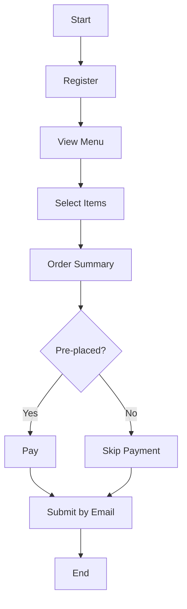

```mermaid
flowchart TD
    A[Start] --> B[Register]
    B --> C[View Menu]
    C --> D[Select Items]
    D --> E[Order Summary]
    E --> F{Pre-placed?}
    F -- Yes --> G[Pay]
    F -- No --> H[Skip Payment]
    G --> I[Submit by Email]
    H --> I
    I --> J[End]
```

